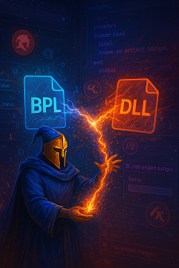

# ToolsAPI Examples for RAD Studio

----

## BPL vs DLL

If you're just getting started with plugin development in RAD Studio, one of the first architectural decisions that you will face is
choosing between using **BPLs** or **DLLs** for your plugin.

### BPL: Built for Delphi, Friendly for Debugging

BPLs are Delphi’s native runtime package format.
They offer deep integration with the Delphi runtime type information (RTTI) system, which allows seamless type sharing between the host application and the plugin.
One of the biggest advantages of using BPLs during development is **easy debugging** as you can load and unload them dynamically within the IDE,
set breakpoints across boundaries, and step through the code as if it were part of your main application.
They also support shared memory management automatically, so you won’t run into issues passing strings or objects between host and plugin.

However, BPLs also come with **deployment complications**. All units in a BPL are shared with the host application at runtime,
which can lead to **unit name conflicts**, especially if multiple plugins reuse common units or third-party components.
This tight coupling can quickly become a headache in larger systems or when mixing packages from multiple vendors.

### DLL: Flexible and Portable, but More Manual Work

DLLs are a more traditional and language-agnostic way of building plugins. Unlike BPLs, DLLs don’t require the host and plugin to share units directly, which
means no risk of unit name collisions.  The tradeoff is in developer ergonomics. DLLs are **harder to debug**, especially when you’re working inside RAD Studio.

### It's Best To Use Both!

A practical approach is to **develop and debug your plugin using a BPL**, where you can take advantage of integrated debugging
and runtime type sharing. Once your plugin is stable, you **deploy it as a DLL** with a clean, defined interface, avoiding unit conflicts.

This hybrid workflow gives you the best of both worlds: productivity during development and flexibility during deployment.

----

## Hybrid Example Project

`Project group found in: Examples\Create BPL and DLL`

This hybrid workflow is demonstrated within this repository with the use of two very basic projects.  One project is a BPL, and one is a DLL and they both share common
plugin implementation code.

### Differences in how plugins are created/destroyed

The small amount of unique code for the BPL is in `radExampleBPLPlugin.Loader.pas` and for the DLL is in `radExampleDLLPlugin.Loader.pas`
- The BPL has a `Register` method which calls our example `InitializeExampleWizard` method when the BPL is loaded and our example `FinalizeExampleWizard` method
is automatically called on `Finalization` when the BPL is being unloaded
- The DLL has a known entry point named `INITWIZARD0001` which is looked for by RAD Studio.
This is called during startup and a RegisterProc is called with our example `InitializeExampleWizard` as the parameter to create the Wizard.
There is an optional `Terminate` parameter which is set to our example `FinalizeExampleWizard` method so clean-up can be performed.

The `FinalizeExampleWizard` does nothing in our example as the project does not need any cleanup.  It is present simply for demonstration purposes.

#### Differences in defining package dependencies

The other difference between a BPL and DLL project involves setting up the runtime package dependencies.
- For a BPL you add `designide, rtl, vcl` the to the `Requires` part of the BPL project.
- For a DLL, these same three packages are set in `Runtime Packages` within `Project Options->Packages`

_Note_ If you don't make the `designide` package available, you will get the very common build error which reports a failure to find the `ToolsAPI` unit.

### Debugging tips
- The BPL is a little easier as you can Load and Unload your BPL while your second copy of Delphi is running.  (Use `Component->Install Packages`)
- The DLL is more difficult as the registry key needs to be present when the second copy of Delphi launches, but shouldn't be present when your
first copy of Delphi is started. (Otherwise the DLL will be in use and you cannot update it to test changes.)

- To debug, configure your `Run->Parameters->Debugger->Target` settings to:
    - Host Application: `$(BDS)\bin\bds.exe`
    - Parameters: `-pDelphi`
- You can then run your DLL/BPL project and RAD Studio will be launched.
- You will get a handful of startup errors when debugging the IDE within the IDE.  These are annoying, but safe to ignore.
- See [docwiki](https://docwiki.embarcadero.com/RADStudio/en/Debugging_a_Wizard) for more info

----

## Dockable Forms

Another struggle for me with Plugin development has been working with dockable forms.  There are some really ancient examples out there but nothing
that was easily grokable to me.  A second example project is in the `Examples\DockableForm` folder which can be used as a reference for quickly
creating a dockable form in a plugin leveraging the `INTAServices270` introduced in [Delphi 11 Alexandria](https://github.com/ideasawakened/DelphiKB/wiki/D28.ALEXANDRIA.11.0.0.0).  
I have a library of ToolsAPI code that has built-up over the years but this example distills the task down to the bare minimum and leverages recent improvements made to the ToolsAPI.

